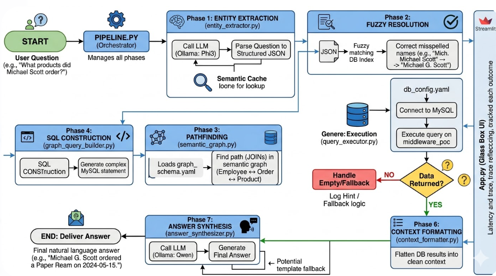

# 🕸️ Semantic Graph RAG Assistant

A production-grade, schema-driven **Retrieval-Augmented Generation (RAG)** system that answers natural language questions about company data using a **semantic graph**, **local LLMs via Ollama**, and **MySQL** — with no vector database required.



---

## 📖 Overview

Graph RAG Assistant translates plain English questions into structured MySQL queries by traversing a semantic entity graph. Instead of embedding documents into a vector store, it models your database schema as a directed graph and uses LLM-powered entity extraction to determine the optimal JOIN path, build a SQL query, execute it, and synthesise a natural language answer.

**Example flow:**
> *"What products did Michael Scott order?"*
> → Extracts `{entities: [Order], filters: {employee_name: "Michael Scott"}}`
> → Finds path `Order → Employee → Product`
> → Builds and executes SQL
> → Returns: *"Michael Scott placed order #13 for 5x Desk Lamp on 2024-12-18 (pending)."*

---

## ✨ Key Features

- **No vector database** — graph traversal replaces embedding-based retrieval entirely
- **Schema-driven, zero hardcoded logic** — all entity rules, join paths, filter keys, and question types live in `graph_schema.yaml`
- **7-phase pipeline** — extraction → fuzzy resolution → pathfinding → SQL construction → execution → context formatting → answer synthesis
- **Local LLM inference** — uses [Ollama](https://ollama.com/) with `phi3:mini` for extraction and `qwen2.5:1.5b` for synthesis
- **Session cache** — semantic similarity cache using `nomic-embed-text` embeddings avoids redundant LLM calls
- **Fuzzy name resolution** — corrects misspelled names (e.g. `"Leslie Knop"` → `"Leslie Knope"`) using `rapidfuzz` before query execution
- **Self-healing** — graceful fallback with entity-specific error messages when queries return no results
- **Glass-box UI** — full audit trail in the Streamlit sidebar: SQL executed, path taken, filters applied, latency breakdown
- **25-question regression suite** — `test_pipeline.py` validates extraction, path, row count, and answer quality end-to-end

---

## 🏗️ Architecture

The pipeline consists of 7 sequential phases, all orchestrated by `pipeline.py`:

| Phase | File | Description |
|-------|------|-------------|
| 1 — Entity Extraction | `entity_extractor.py` | LLM (phi3:mini) parses question → structured JSON `{entities, filters, question_type}` |
| 2 — Fuzzy Resolution | `fuzzy_resolver.py` | Corrects misspelled names against live DB index using `rapidfuzz` |
| 3 — Pathfinding | `semantic_graph.py` | NetworkX graph finds optimal JOIN chain between entities |
| 4 — SQL Construction | `graph_query_builder.py` | Builds parameterised MySQL query from traversal path |
| 5 — Execution | `query_executor.py` | Runs query via MySQL connection pool; handles empty results |
| 6 — Context Formatting | `context_formatter.py` | Flattens DB rows into clean LLM-readable context |
| 7 — Answer Synthesis | `answer_synthesizer.py` | LLM (qwen2.5:1.5b) generates natural language answer with contradiction guard |

---
## 📁 Project Structure
 
```
.
├── middleware/
│   ├── __init__.py
│   ├── pipeline.py              # Orchestrator — runs all 7 phases
│   ├── entity_extractor.py      # Phase 1: LLM extraction + session cache
│   ├── fuzzy_resolver.py        # Phase 2: Name correction via rapidfuzz
│   ├── semantic_graph.py        # Phase 3: NetworkX graph traversal
│   ├── graph_query_builder.py   # Phase 4: SQL construction
│   ├── query_executor.py        # Phase 5: MySQL execution
│   ├── context_formatter.py     # Phase 6: Result formatting
│   ├── answer_synthesizer.py    # Phase 7: LLM synthesis + template fallback
│   └── models.py                # Pydantic data models
├── config/
│   ├── graph_schema.yaml        # ⭐ Central schema — entities, edges, filters, rules
│   ├── intents.yaml             # Model config (Ollama endpoints, temperatures)
│   └── db_config.yaml           # MySQL connection settings
├── database/
│   ├── schema.sql               # MySQL DDL
│   └── seed.sql                 # Sample data (17 employees, 6 projects, 16 orders…)
├── app.py                       # Streamlit UI with glass-box audit trail
├── requirements.txt
└── assets/
    └── Screenshot_2026-03-20_115202.png
```

---

## 🚀 Getting Started

### Prerequisites

- Python 3.10+
- MySQL 8.0+
- [Ollama](https://ollama.com/) installed and running locally

### 1. Clone and install dependencies

```bash
git clone https://github.com/your-org/graph-rag-assistant.git
cd graph-rag-assistant
pip install -r requirements.txt
```

### 2. Pull Ollama models

```bash
ollama pull phi3:mini               # Entity extraction
ollama pull qwen2.5:1.5b            # Answer synthesis
ollama pull nomic-embed-text:latest # Session cache embeddings
```

### 3. Set up the database

```bash
mysql -u root -p < schema.sql
mysql -u root -p < seed.sql
```

Update `config/db_config.yaml` with your MySQL credentials:

```yaml
database:
  host: "localhost"
  port: 3306
  user: "root"
  password: "your_password"
  database: "middleware_poc"
```

### 4. Run the app

```bash
streamlit run app.py
```

The UI will be available at `http://localhost:8501`.

---

## 🧪 Running Tests

The regression suite runs 25 questions across 3 difficulty blocks and validates extraction, JOIN path, row count, and answer quality:

```bash
# Run all 25 questions
python test_pipeline.py

# Run a specific block
python test_pipeline.py --block 1

# Run specific question IDs
python test_pipeline.py --q 5 12 21

# Write results to a custom directory
python test_pipeline.py --out ./results
```

Output files: `test_report.txt` (human-readable), `test_results.csv`, `test_results.json`.

Each question is graded on 5 checks: **[E]**ntities · **[F]**ilters · **[P]**ath · **[R]**ows · **[A]**nswer.

---

## 🗂️ Supported Question Types

| Type | Example |
|------|---------|
| `lookup` | *"What is Alan Turing's salary?"* |
| `list` | *"Show me all active projects"* |
| `comparison` | *"What is the most expensive product?"* |
| `cross_entity` | *"Which Engineering employees are on active projects?"* |
| `aggregation` | *"Rank departments by total salary budget"* |
| `having_count` | *"Which employees are assigned to more than one project?"* |
| `temporal_filter` | *"Show me projects started after January 2025"* |
| `computed_delta` | *"What is the salary gap between highest and lowest paid?"* |

---

## ⚙️ Configuration

All domain logic lives in **`config/graph_schema.yaml`** — no Python changes needed for:

- Adding a new entity (table) with its filterable columns
- Adding a new JOIN edge between entities
- Declaring aggregation, delta, or having-count defaults
- Adding fuzzy-match rules, temporal columns, or empty-result messages

Model settings (endpoints, temperatures, context windows, cache thresholds) are in **`config/intents.yaml`**.

---

## 🛡️ Design Principles

- **Schema-first** — YAML is the single source of truth; Python reads it generically
- **No hallucination** — LLM output is validated against the schema before use; invalid entities and filter keys are stripped
- **Contradiction guard** — synthesised answers are checked against DB results; denial phrases on non-empty results trigger a template fallback
- **Completeness check** — every name and currency value in the DB result must appear in the final answer
- **Graceful degradation** — every phase has a fallback so the system always returns a coherent response

---

## 📊 Sample Questions to Try

```
What is Alan Turing's salary?
Which department does Sarah Connor belong to?
Show me everyone working on projects managed by Don Draper
How many employees are assigned to more than one project?
List all pending orders for furniture items
Which team has the biggest payroll?
Tell me about the people assigned to the Platform Migration project
Show me delivered orders placed by people in Sales
```

---

## 🧩 Tech Stack

| Component | Technology |
|-----------|-----------|
| LLM Inference | [Ollama](https://ollama.com/) — phi3:mini, qwen2.5:1.5b |
| Embeddings | nomic-embed-text (via Ollama) |
| Graph Traversal | [NetworkX](https://networkx.org/) |
| Database | MySQL 8 via `mysql-connector-python` |
| Fuzzy Matching | [rapidfuzz](https://github.com/maxbachmann/RapidFuzz) |
| UI | [Streamlit](https://streamlit.io/) |
| Data Models | [Pydantic v2](https://docs.pydantic.dev/) |
| Schema Config | YAML |

---

## 📄 License

MIT License — see [LICENSE](LICENSE) for details.
